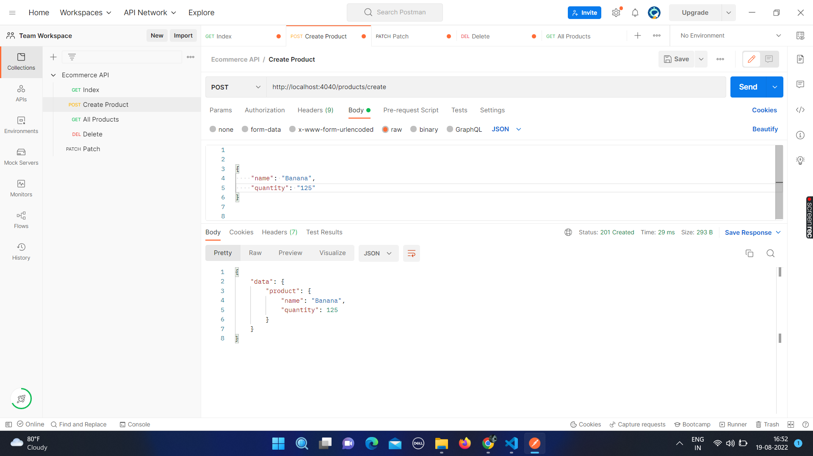
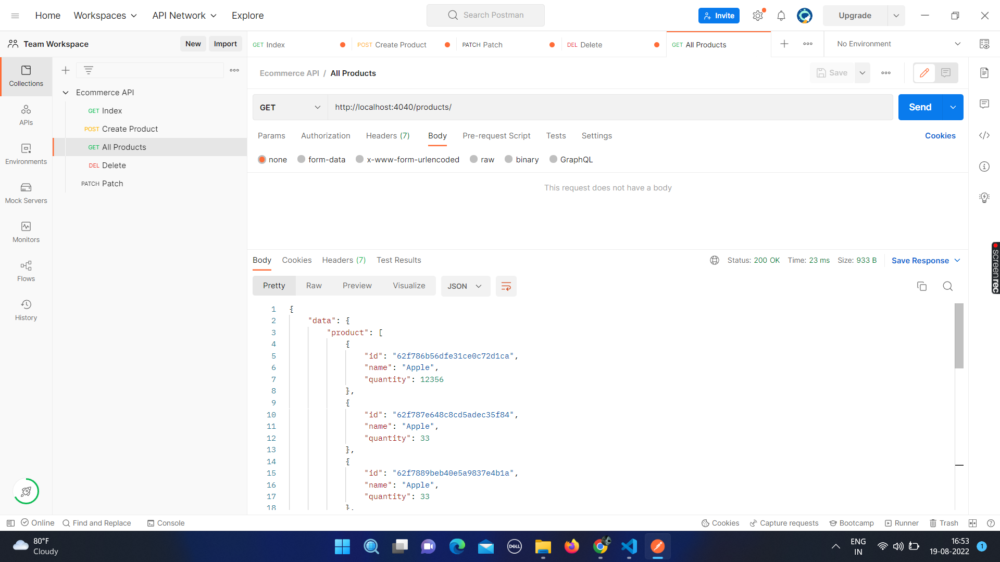
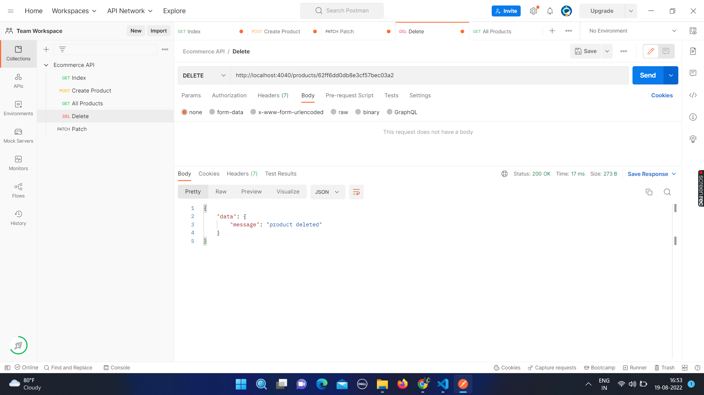
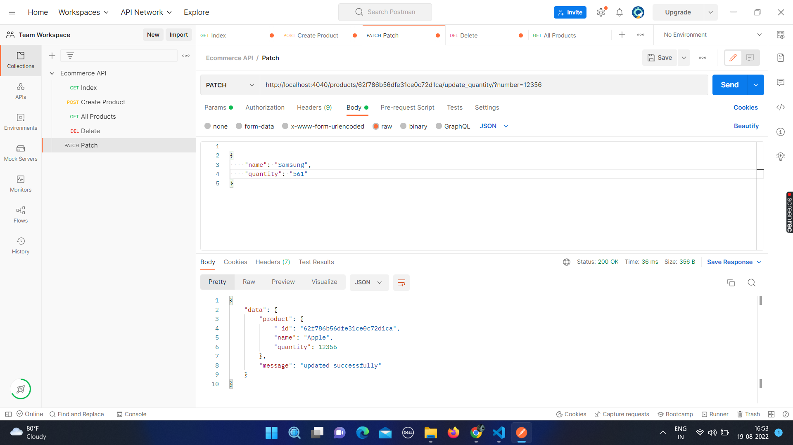

# Ecommerce_API
 
 Design an API for an ecommerce platform admin to manage product inventory.
 
 ## Hosted link :-
 https://ecommerceapi00.herokuapp.com/products

# All Product

# Create Product

# Delete Product

# Update Product

#note : Attached the Postman Collection in the root directory.
